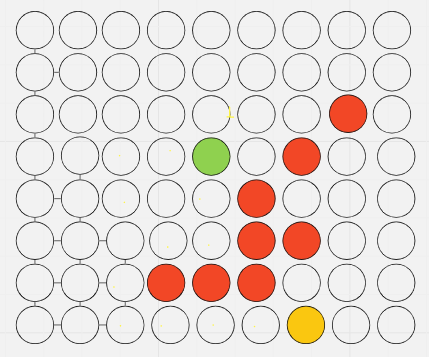

# Shortest Path Finder

This project is a cool interactive game that applies Graph Theory concepts to find the shortest path in a maze. The user guides a red block through a field, avoiding brown walls, to reach a yellow exit. Let's break down how it's done:

## `global.js`

This file sets up the canvas, defines global variables, and handles key presses. Here's what's happening:

- **Canvas and Context**: We grab the canvas element and its 2D context, which we'll use to draw our game.
- **Global Variables**: `speed`, `tileCount`, `tileSize`, and others dictate how our game behaves and looks.
- **Key Press Events**: We listen for arrow key presses and change the block's velocity accordingly.
- **Dashboard Function**: Updates the dashboard showing the current X and Y position of the block.

## `main.js`

Here we're initiating the game:

- **Game Loop**: We continuously clear the canvas, update the dashboard, and draw the game elements at a specific speed.

## `block.js`

Defines the red block's behavior:

- **Properties**: `headX`, `headY`, and `color` determine the block's position and appearance.
- **`draw()`:** Fills a square on the canvas corresponding to the block's position.
- **`wallCollision()`:** Ensures the block doesn't go through walls.
- **`changePosition()`:** Updates the block's position based on its velocity.

## `exit.js`

This is all about the yellow exit square:

- **Properties**: `xExit`, `yExit`, and `color` determine the exit's position and appearance.
- **`draw()`:** Fills a square on the canvas for the exit.
- **`checkCollision()`:** Randomly repositions the exit if the block finds it, making sure it's not on a wall.

## `walls.js`

Defines the brown walls:

- **`positionsRandom()`:** Randomly places walls on the canvas, avoiding the block and exit.
- **`draw()`:** Draws the walls on the canvas.

## `shortestPath.js`

This is where the magic happens!

- **`createGraph()`:** Creates a graph from the canvas where nodes are free spaces and edges connect adjacent nodes.
- **`bfs()`:** Breadth-First Search algorithm to find the shortest path from the block to the exit.
- **`findPath()`:** Uses `bfs()` to determine the path, and moves the block along that path. Also highlights the path.

## Conclusion

In essence, this project is a fun way to explore pathfinding algorithms. The block navigates through the maze, avoiding walls, and you can visually see the shortest path it takes to find the exit. Cool, isn't it? 🎮🚀